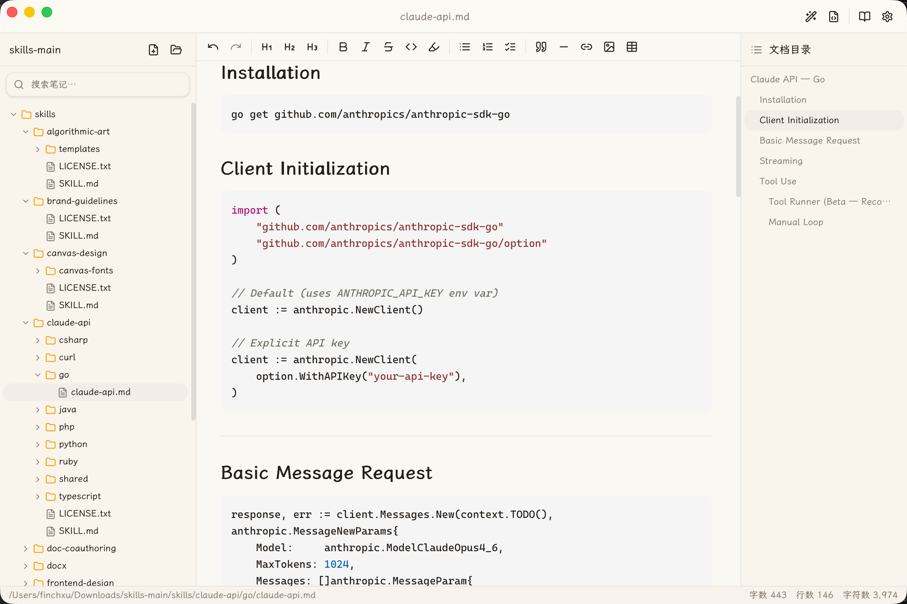

<p align="right"><a href="README_EN.md">English</a></p>

<p align="center">
  
</p>

<h1 align="center">PiDanMD 皮蛋记</h1>

<p align="center">
  
  
  
  
  
  
  
</p>

<p align="center">一个轻量美观的跨平台 Markdown 编辑器桌面应用，支持 macOS / Windows / Linux，提供实时预览、GFM、数学公式与代码高亮，开箱即用，并使用了霞鹜文楷字体美观简洁。</p>

<p align="center">
  
</p>

## 已实现功能

- **实时预览** — 一键切换预览，拒绝左右分栏。
- **多渲染模式** — 内置标准 Markdown、skills、Hexo、Jekyll、Hugo 渲染，博客写作开箱即用
- **GFM + 数学公式 + 代码高亮** — 支持 GitHub Flavored Markdown、KaTeX 公式、Shiki 语法高亮与 Mermaid 图表
- **原生跨平台** — 基于 Tauri 2，安装包体积小、启动快，覆盖 macOS / Windows / Linux / x86_64 / ARM
- **多语言支持** — 简体中文、繁體中文、English、日本語、한국어，自动跟随系统语言
- **精心排版** — 内置霞鹜文楷 + Cascadia Code NF，中英文混排美观舒适
- **文件树 + 大纲** — 侧栏文件管理与目录导航，轻松组织项目文档。

## 平台支持

| 操作系统 | 架构 | 最低版本 | 安装格式 |
|---------|------|---------|---------|
| macOS | ARM64 (Apple Silicon) | macOS 14.6 (Sonoma) | `.dmg` |
| Windows | x64 | Windows 10 (1803+) | `.msi` `.exe` |
| Windows | ARM64 | Windows 11 | `.msi` `.exe` |
| Linux | x64 | Ubuntu 22.04 / glibc 2.35+ | `.deb` |

## 技术选型

| 层级 | 技术 |
|------|------|
| 桌面框架 | Tauri 2 |
| 前端框架 | React 19 |
| 编辑器内核 | Tiptap 3 (ProseMirror) |
| UI 组件 | shadcn/ui (New York) |
| 状态管理 | Zustand |
| 样式 | Tailwind CSS 4 |
| 图标 | Lucide React |
| 构建工具 | Vite |
| 语言 | TypeScript 5 + Rust |

## 环境要求

- [Rust](https://rustup.rs/) (stable 1.80+)
- [Node.js](https://nodejs.org/) (v18+)
- [pnpm](https://pnpm.io/) (v10+)
- 各平台 Tauri 2 系统依赖，参考 [Tauri 官方文档](https://v2.tauri.app/start/prerequisites/)

## 开发调试

```bash
# 1. 安装前端依赖
pnpm install

# 2. 启动开发模式（前端热更新 + Rust 自动重编译）
pnpm tauri dev
```

开发模式下 Vite 开发服务器运行在 `http://localhost:5173`，Tauri 窗口会自动加载该地址。前端代码修改后自动热更新，Rust 代码修改后会自动重新编译并重启应用。

如果只需要调试前端（不启动 Tauri 桌面窗口），可以单独启动 Vite：

```bash
pnpm dev
```

然后在浏览器中打开 `http://localhost:5173`（注意：Tauri API 调用在浏览器中不可用，仅用于调试 UI 布局和样式）。

## 打包构建

```bash
# 构建当前平台的安装包
pnpm tauri build
```

构建产物位于 `src-tauri/target/release/bundle/`，根据平台不同会生成：

| 平台 | 产物 |
|------|------|
| macOS | `.dmg`, `.app` |
| Windows | `.msi`, `.exe` (NSIS) |
| Linux | `.deb`, `.rpm`, `.AppImage` |

如需仅构建前端（不打包桌面应用）：

```bash
pnpm build
```

构建产物位于 `dist/` 目录。

## 项目结构

```
PiDanMD/
├── src/                    # 前端源码 (React + TypeScript)
│   ├── components/ui/      # 通用 UI 组件 (shadcn/ui)
│   ├── features/           # 功能模块
│   │   ├── editor/         # Tiptap 编辑器
│   │   ├── settings/       # 设置弹窗
│   │   ├── sidebar/        # 文件侧栏
│   │   └── titlebar/       # 自定义标题栏
│   ├── stores/             # Zustand 状态管理
│   ├── lib/                # 工具函数 (Tauri 命令、i18n、配置持久化)
│   ├── hooks/              # React Hooks
│   ├── styles/             # 编辑器样式
│   ├── App.tsx             # 根组件
│   └── main.tsx            # 入口
├── src-tauri/              # Rust 后端 (Tauri 2)
│   ├── src/
│   │   ├── commands/       # Tauri 命令 (文件操作、配置、字体)
│   │   ├── menu.rs         # 应用菜单
│   │   └── state.rs        # 应用状态
│   └── tauri.conf.json     # Tauri 配置
├── public/                 # 静态资源 (logo、字体)
└── package.json
```

## 内置字体

本项目内置以下字体，详见 [THIRD_PARTY_LICENSES](THIRD_PARTY_LICENSES.md)。

| 字体 | 用途 | 许可证 |
|------|------|--------|
| LXGW WenKai Screen (霞鹜文楷屏幕阅读版) | 正文 / UI | SIL OFL 1.1 |
| Cascadia Code NF | 代码 | SIL OFL 1.1 |
| Noto Color Emoji | Emoji | SIL OFL 1.1 + Apache 2.0 |
| Noto Sans Symbols | 符号 | SIL OFL 1.1 |

## 许可证检查

本项目使用 [cargo-deny](https://github.com/EmbarkStudios/cargo-deny) 检查 Rust 依赖的许可证兼容性。

```bash
cargo install cargo-deny        # 首次使用需安装
cd src-tauri && cargo deny check licenses
```

## 致谢

本项目的界面设计受到 [妙言 MiaoYan](https://github.com/tw93/MiaoYan) 的启发。如果你正在寻找一款原生 macOS Markdown 编辑器，强烈推荐妙言。

## License

[MIT](LICENSE)
