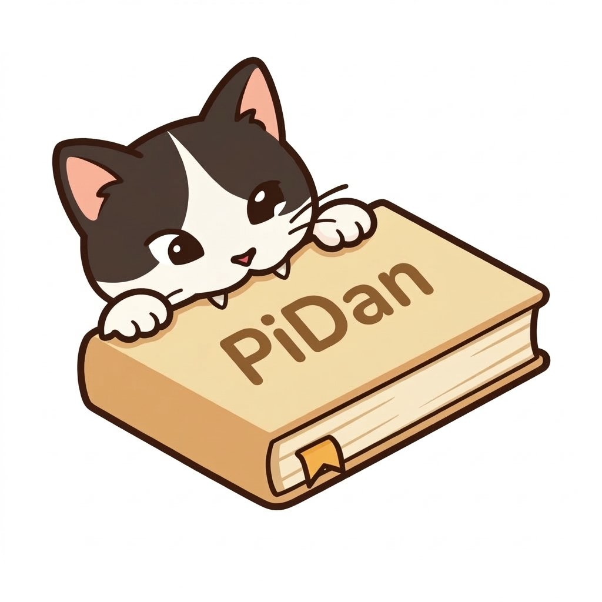
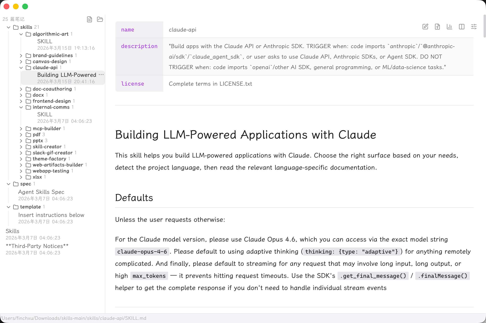

<p align="right"><a href="README.md">中文</a></p>

<p align="center">
  
</p>

<h1 align="center">PiDanMD</h1>

<p align="center">
  
  
  
  
  
  
</p>

<p align="center">A lightweight and elegant cross-platform Markdown editor for macOS, Windows, and Linux. Features live preview, GFM, math equations, syntax highlighting, and ships with the beautiful LXGW WenKai font out of the box.</p>

<p align="center">
  
</p>

## Platform Support

| OS | Architecture | Minimum Version | Format |
|----|-------------|----------------|--------|
| macOS | ARM64 (Apple Silicon) | macOS 14.6 (Sonoma) | `.dmg` |
| macOS | x64 (Intel) | macOS 14.6 (Sonoma) | `.dmg` |
| Windows | x64 | Windows 10 (1803+) | `.msi` `.exe` |
| Windows | ARM64 | Windows 11 | `.msi` `.exe` |
| Linux | x64 | Ubuntu 22.04 / glibc 2.35+ | `.deb` `.AppImage` |
| Linux | ARM64 | Ubuntu 22.04 / glibc 2.35+ | `.deb` `.AppImage` |
| Fedora | x64 | Fedora 40+ | `.rpm` |
| Fedora | ARM64 | Fedora 40+ | `.rpm` |

## Tech Stack

| Layer | Technology |
|-------|-----------|
| Desktop Framework | Tauri 2 |
| Frontend Framework | SolidJS |
| Editor Engine | CodeMirror 6 |
| Markdown Rendering | unified (remark + rehype) |
| Syntax Highlighting | Shiki |
| Math Equations | KaTeX |
| Styling | Tailwind CSS 4 |
| Icons | Lucide |

## Development

Prerequisites: [Rust](https://rustup.rs/) and [pnpm](https://pnpm.io/).

```bash
pnpm install
pnpm tauri dev
```

## Build

```bash
pnpm tauri build
```

## Language Support

The UI supports Simplified Chinese, Traditional Chinese, English, Japanese, and Korean. You can switch languages in settings, or let it follow the system language automatically.

## Bundled Fonts

This project bundles the following fonts. See [THIRD_PARTY_LICENSES](THIRD_PARTY_LICENSES) for details.

| Font | Usage | License |
|------|-------|---------|
| LXGW WenKai Screen | Body / UI | SIL OFL 1.1 |
| Cascadia Code NF | Code | SIL OFL 1.1 |
| Noto Color Emoji | Emoji | SIL OFL 1.1 + Apache 2.0 |
| Noto Sans Symbols | Symbols | SIL OFL 1.1 |

## License Audit

This project uses [cargo-deny](https://github.com/EmbarkStudios/cargo-deny) to check Rust dependency license compatibility.

```bash
cargo install cargo-deny        # first-time setup
cd src-tauri && cargo deny check licenses
```

## Acknowledgments

The UI design of this project is inspired by [MiaoYan](https://github.com/tw93/MiaoYan). If you are looking for a native macOS Markdown editor, MiaoYan is highly recommended.

## License

[MIT](LICENSE)
